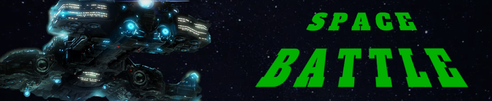

# Projeto: Criando seu jogo no estilo Space Shooter

Nesse projeto, o desafio será criar um Space Shooter utilizando HTML, CSS e Javascript. Aprenderemos juntos a trabalhar com posicionamento no CSS e lógica de programação utilizando posicionamento com CSS, manipulação do DOM, eventListeners, e manipulação de Array.

## Tecnologias

* HTML5
* CSS3
* Javascript

## Instrutor(a)

Gabriela Pinheiro

Frontend Engineer, Cornershop by Uber

## Entidade

Digital Inovation one 

## Autor
Edson souza

[Linkedin](https://www.linkedin.com/in/edsonfrs/)

[GitHub](https://github.com/Edsonfrs)

## Créditos

Imagem do Letreiro [pngimg.com](https://pngimg.com)

Imagem [Starcraft Space Ship](https://pngimg.com/image/58950)

Edição da Imagem [Gimp](https://www.gimp.org)

